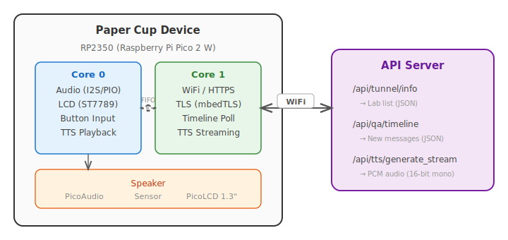

# Ito-Denwa — String Phone Device

A WiFi-enabled communication device shaped like a traditional Japanese string telephone (糸電話). All electronics are housed inside a paper cup form factor, providing children with a safe, screen-free way to talk with friends and family.

## Background

Growing concern over children's smartphone dependency is driving demand for screen-free alternatives worldwide. In the US, a Seattle startup called **Tin Can Antechnologies** launched a $100 WiFi-enabled "landline" phone for kids in April 2025. With no large-scale marketing — only word-of-mouth — the device sold hundreds of thousands of units in its first year, fueled by parents' desire to delay smartphone adoption and a wave of nostalgia among Gen X and Millennial parents. Schools have emerged as one of the fastest-growing sales channels, with thousands of administrators exploring bulk deployments to curb early social media dependency.

Ito-Denwa takes this concept further by adopting the form factor of a Japanese string telephone (糸電話) — a paper cup that children speak into and hold to their ear, just like the real thing. Where Tin Can emulates a retro landline, Ito-Denwa leans into the tactile, analog warmth of a toy that every child recognizes.

## Concept

Key design principles:

- **Screen-free**: No touchscreen, no social media, no internet browsing
- **Simple operation**: Hold to mouth to talk, hold to ear to listen
- **Parental control**: Contact management and usage monitoring via a companion smartphone app
- **Safety first**: Only communicates with registered contacts; no location tracking

## Architecture

The firmware runs on an **RP2350 (Raspberry Pi Pico 2 W)** using a dual-core cooperative architecture:

| Core | Responsibility |
|------|---------------|
| Core 0 | Audio playback (I2S/PIO/DMA), LCD rendering (ST7789), button input |
| Core 1 | WiFi networking, HTTPS/TLS communication, timeline polling, TTS streaming |

Cores communicate via a lock-free SPSC ring buffer (`ic_ring`) with hardware FIFO notifications.

### System Flow



## Hardware

| Component | Detail |
|-----------|--------|
| CPU | RP2350 (Raspberry Pi Pico 2 W) |
| Audio | PicoAudio — I2S via PIO, DMA-driven ring buffer |
| Display | PicoLCD 1.3" (ST7789, 240×240, SPI) for status indication |
| Connectivity | WiFi 2.4 GHz (CYW43 on Pico 2 W) |
| Battery | Li-Po 1000 mAh (est. 6–8 hrs) |
| Charging | USB-C |
| Size | Paper cup form factor (~φ75 mm × 90 mm, ~120 g) |

Additional components inside the cup: microphone, speaker, proximity sensor (mouth/ear detection).

## Building

### Prerequisites

- [Pico SDK](https://github.com/raspberrypi/pico-sdk) (≥ 1.3.0)
- ARM GCC toolchain (`arm-none-eabi-gcc`)
- CMake ≥ 3.12

### Environment

Set the following environment variables (or edit `.envrc`):

```bash
export PICO_SDK_PATH="$HOME/git/pico-sdk"
export PICO_TOOLCHAIN_PATH="$HOME/git/gcc-arm-none-eabi-10.3-2021.10/bin"
export PICO_BOARD=pico2_w

# Device configuration
export WIFI_SSID="your-wifi-ssid"
export WIFI_PASSWORD="your-wifi-password"
export API_URL="https://your-api-server.example.com"
export DEVICE_ID="your-device-uuid"
```

### Build

```bash
cd cmake.rp2350
mkdir -p build && cd build
cmake ..
make -j$(nproc)
```

The output `.uf2` file can be flashed to the Pico 2 W via USB mass-storage mode.

## Source Structure

```
examples/ito-denwa/
├── main.c                  # Application entry, dual-core state machines,
│                           #   HTTPS client, timeline polling, TTS queue
├── cmake.rp2350/
│   ├── CMakeLists.txt      # Build configuration for RP2350
│   └── pico_sdk_import.cmake
├── inc/
│   ├── audio.h             # I2S audio playback API
│   ├── ic_ring.h           # Inter-core SPSC ring buffer
│   ├── st7789.h            # LCD driver API
│   ├── lwipopts.h          # lwIP stack configuration
│   └── mbedtls_config.h    # mbedTLS configuration
└── src/
    ├── audio.c             # PIO I2S + DMA audio engine
    ├── i2s.pio             # PIO program for I2S output
    ├── ic_ring.c           # Inter-core message bus implementation
    └── st7789.c            # ST7789 SPI LCD driver
```

## Dependencies

- [Pico SDK](https://github.com/raspberrypi/pico-sdk) — WiFi, lwIP, mbedTLS, PIO, DMA
- [cJSON](https://github.com/DaveGamble/cJSON) — JSON parsing (from `third_party/cJSON/`)
